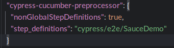

# HOW TO USE CUCUMBER-PREPROCESSOR INSIDE A CYPRESS PROJECT

#### Please follow the steps below:

- Make sure that we have **_NodeJS_** and **_npm_** installed on your machine, otherwise you need to download it from **_nodejs.org_** site
- Create an empty folder and open it with an IDE
- Open the terminal in the same path of the folder and then type
  **_npm init_** => it generates the **_package.json_** file
- Install **_cypress_** and **_cypress-cucumber-preprocessor_** using npm commands

  `npm –save -dev install cypress`

  `npm –save -dev install cypress-cucumber-preprocessor`
 
- Check the cypress installation with **_npx cypress verify_** command
- Open cypress console by running **_npx cypress open_** and configure it for doing **_e2e test_**
- It creates the **_e2e folder_** in your project structure in which you can put test files
- Create your own sub-folder under e2e and use it to put the steps definitions file (pay attention to the name, it must be the same)
- Now update the **_package.json_** file

- Update also the **_cypress.config.js_** file

- Run test using **_npx cypress open_** command and then click on the feature file